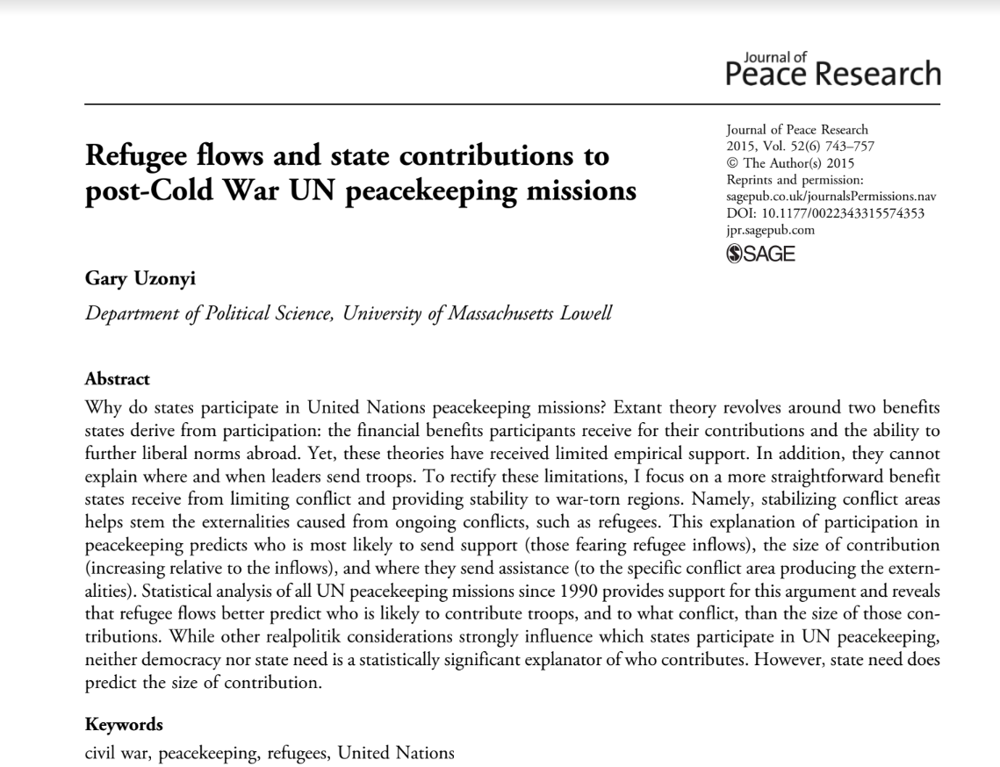

```{r setup, echo = F, message = F, error = FALSE, include=FALSE}

library(gtable)

library(tidyverse)
library(kableExtra)
setwd('C:/Users/nourm/OneDrive/Data Analysis/WD')
library(haven)
library(patchwork)
library(linelist)
library(rmarkdown)
library(knitr)
library(tinytex)
library(readxl) 
library(dplyr)
library(ggplot2)
library(readr)
library(tidyverse)
library(ggplot2)
library(flextable)
library(ggpubr)
library(xaringanthemer)


load("refpkn (1).rdata")


```
---
```{r echo=FALSE, out.width = "30%", fig.align = "center"}

```

 - The Data was collected from The Journal Of Peace Research and is used to understand the motives of states' participation in the UN peacekeeping troop contributions.


-  The data was collected by scholar Dr. Gary Uzonyi, Department of Political Science, University of Massachusetts Lowell, in  his research paper, " Refugee flows and state contributions to post-Cold War UN peacekeeping missions," Journal of Peace Research 2015, Vol. 52(6) 743–757. 

---
## Why do states contribute soldiers to United Nations peacekeeping missions?


The data explores the current understanding of UN peacekeeping troop contributions focusing on two aspects: 

- Which states participate in missions. 
- Which conflicts they send troops to and the size of contributions. 

The author also focuses on the benefits that countries get from reducing conflict and ensure stability to war-torn regions.


```{r message=FALSE, warning=FALSE, include=FALSE}

summarize(refpk,
min(refinflow,na.rm=T),
max(refinflow,na.rm=T))

summarize(refpk,
min(troops,na.rm=T),
max(troops,na.rm=T))

lm(troops ~ refinflow, refpk) %>%
summary(.)

lm(troops ~ totalrefs, refpk) %>%
summary(.)

lm(troops ~ refinflow + totalrefs,refpk) %>%
summary(.)

summarize(refpk,
min(refinflow,na.rm=T),
max(refinflow,na.rm=T))
0.0001723*(0)
0.0001723*(330001)

0.0001127*(100000)

```

---
# Quick look on refugees and troops

The increase in refugee flows in relation to the number of troops deployed. 
Maximum number of refugees: 330001 refugees
minimum number of refugees: 0 refugees


Maximum number of troops: 7243 troops
minimum number of troops: 0 troops

In general, the number of refugees exceeds the number of troops deployed regardless of area. 

**When the refugee inflow increases, we predict the number of deployed troops will increase to 56.85.** 


**When the total number of refugees increases by 100000, the number of troops deployed increases by 11.27.**


---
```{r plot 1, echo = FALSE, message=FALSE, warning=FALSE, error=FALSE}

ggplot(refpk,aes(refinflow,troops))+
  geom_jitter(color= "black", shape = 10, fill= "lightblue", size=3) +
  coord_cartesian(x=c(0,400000),
                         y=c(0,8000))+
  labs(x= 'Refugee inflow',
         y= 'peacekeeping force') 
```
- There is a correlation between the number of troops deployed by a state and the number of refugees inflow (in addition to the
total number of refugees fleeing conflict areas).

---
```{r plot 2, echo = FALSE, message=FALSE, warning=FALSE, error=FALSE}
      
ggplot(refpk,aes(totalrefs,troops))+
  geom_jitter(color= "black", shape = 10, fill= "lightblue", size=3) +
  coord_cartesian(x=c(0,3000000),
                  y=c(0,8000))+
         labs(x= 'Refugee inflow',
                y= 'peacekeeping force') 

                
```
- The refugee emergence from a conflict area  led to limited deployment  of peacekeeping forces  from third-party states.

---
```{r plot 3, echo= F, message=FALSE, warning=FALSE, error=FALSE}

newref <- filter(refpk,missioncode==55,year==1993)
filter(newref,!is.na(regime)) %>%
  ggplot(.,aes(distance,contribute)) +
  geom_jitter(height = 0.055,
              shape = 25,
              size = 1,
              aes(fill = regime)) +
  geom_smooth(method = lm,
              lty = 3) +
  scale_y_continuous(
    breaks=c(0,1),
    labels=c('N', 'Y')) +
               labs(x = 'Distance',
                      y = 'Contribution',
                      title = 'UN Peace Keeping contribution' )

```

- The graph shows that the closer a country is to ex, Cambodia, the higher the chances that a third-party state will send its troops as part of the UN Peace keeping mission. 


